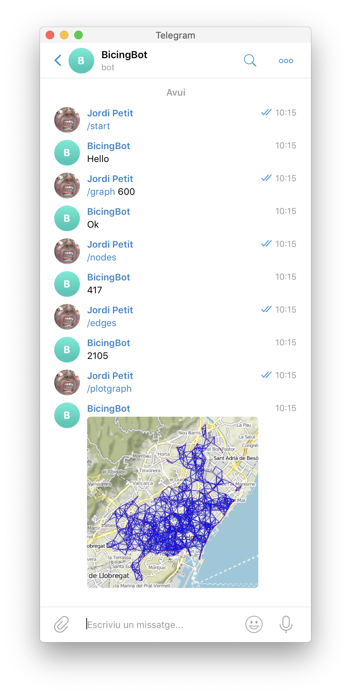

# BicingBot

El projecte BicingBot per AP2 (edició 2019).


## Introducció

Aquesta pàgina descriu el projecte BicingBot, que correspon a la segona pràctica del curs 2019 d'AP2 al GCED. La vostra tasca consisteix en implementar un Bot de Telegram que contesti textualment i gràficament (amb mapes) preguntes relacionades amb grafs geomètrics definits sobre les estacions del Bicing de Barcelona.

Aquí en teniu una petita demostració:

<center></center>


## Grafs geomètrics

Un conjunt de punts en un espai i una distància *d* defineixen un graf geomètric que té com a vèrtexs els punts i, com arestes, aquells parells de punts que es troben a distància `<= d`.


## Dades

Les dades amb les estacions de Bicing de la ciutat de Barcelona (mecàniques i elèctriques) es poden trobar a:

[https://api.bsmsa.eu/ext/api/bsm/gbfs/v2/en/station_information](https://api.bsmsa.eu/ext/api/bsm/gbfs/v2/en/station_information)

Aquest és un arxiu en format JSON que inclou diverses informacions sobre les estacions de bicing (coordenades geogràfiques, adreça, etc.).


## Comandes del Bot

El vostre Bot ha d'entendre i contestar correctament les comandes següents:

- `/start`

    Inicia la conversa amb el Bot.

- `/help`

    El Bot ha de contestar amb una llista de totes les possibles comandes i una breu documentació sobre el seu propòsit i ús.

- `/authors`

    El Bot ha d'escriure el nom complet dels autors del projecte i els seus correus electrònics oficials.

- `/graph ⟨distance⟩`

     Indica al bot que, a partir d'aquest moment, utilitzi un nou graf. Per fer-ho, cal que descarregui les dades actuals de les estacions de bicing i construeixi el graf geomètric amb distància `⟨distance⟩` (en metres).

    **Nota:** Totes les comandes posteriors usen el darrer graf generat amb aquesta comanda. Per defecte, cal començar amb un graf inicial amb distància 1000.

- `/nodes`

    Escriu el nombre de nodes en el graf.

- `/edges`

    Escriu el nombre d'arestes en el graf.

- `/components`

   Escriu el nombre de components connexs en el graf.

- `/plotgraph`

    Mostra una mapa amb totes les estacions del graf i les arestes que es connecten.

- `/route origen, destí`

    Mostra una mapa amb el camí més ràpid per anar d'un punt d'orígen a un punt de destí. Els punts d'orígen i de destí es dónen a través de dues adreces de Barcelona separades per una coma. Per exemple:

    - `/route Passeig de Gràcia 92, La Rambla 51`
    - `/route Jordi	Girona, Plaça de Sant Jaume`

    La ruta ha de minimitzar el temps esperat de desplaçament, tenint en compte que la manera de desplaçar-se és a peu i/o en bicicleta. Els trams a peu es poden fer del punt d'orígen a una estació de bicing, o d'una estació de bicing al punt de destinació. Els trams en bicicleta es poden fer entre parells d'estacions de bicing a distància menor o igual que ⟨distance⟩ (és a dir, a través de les arestes del graf). La velocitat mitjana a peu és de 4 km/h i en bici de 10 km/h. Els trajectes es mesuren a vol d'ocell (línia recta).


Tracteu els errors i situacions anòmales de manera raonable. En particular, el vostre programa no s'hauria d'espatllar per peticions incorrectes dels usuaris.


## Arquitectura del sistema

Els sistema hauria de ser construït al voltant de l'objecte `Graph` de  la llibreria `NetworkX` i ha de tenir dos mòduls:

- `data.py` amb tot el codi relacionat amb la adquisició de dades, construcció del graf i càlculs sobre el graf.

- `bot.py` amb tot el codi relacionat amb el bot de Telegram.

Cal dissenyar el sistema de tal manera que `data.py` sigui independent de `bot.py`. Probablement no caldrà que dissenyeu les vostres classes. Utilizant els grafs de `NetworkX` i les tuples, llistes, conjunts i diccionaris de python hauria de ser suficient.


## Eficiència

**Important:** Tots els algorismes dissenyats o utilitzats en aquest projectes han de tenir complexitat `O((|V|+|E|) log |V|)`. En particular, és important crear el graf geomètric eficientment. En aquest cas, podeu suposar que les estacions estan ben distribuïdes per cobrir la ciutat. De cara a l'anàlisi de complexitat de l'algorisme, podeu suposar que les estacions estan uniformement distribuïdes.

Tingueu en compte que heu de descarregar les dades remotament. Amb connexions lentes això pot prendre una mica de temps. Tingueu també en compte que la generació de mapes es fa remotament.  Amb una conexió lenta pot trigar en generar-los. Telegram tampoc envia les imatges massa ràpid. No us en preocupeu.


## Llibreries

Utilitzeu les llibreries de Python següents:

- `pandas` per a utilitzar `DataFrames`.
- `networkx` per a manipular grafs.
- `haversine` per a calcular distàncies entre coordenades.
- `geopy` per a calcular coordenades geogràfiques (latitud, longitud) a partir d'adreces.
- `staticmap` per pintar mapes.
- `python-telegram-bot` per interactuar amb Telegram.

Podeu utilitzar lliurament altres llibreries estàndards de Python, però si no són estàndards, heu de demanar permís als vostres professors (que segurament no us el donaran).


## Fonts d'informació

Aquests enllaços us seran útils per fer el vostre projecte:

- [Lliçons de bots de Telegram](https://lliçons.jutge.org/python/telegram.html)

- [Lliçons de fitxers en Python](https://lliçons.jutge.org/python/fitxers-i-formats.html)

- [Tutorial de NetworkX](https://networkx.github.io/documentation/stable/tutorial.html)

- [Notebook (per jupyter) on es donen alguns exemples d'utilització d'alguns mòduls](https://raw.githubusercontent.com/jutge-org/ap2-bicingbot-2019/master/Annex.ipynb?token=AAR6FTTUZJBDB4T5IZZMX3K4ZQYFK).
   Vegeu https://nbviewer.jupyter.org/urls/jpetit.jutge.org/Annex.ipynb

# Instruccions

## Equips

Podeu fer aquest projecte sols o en equips de dos. En cas de fer-lo en equip, la càrrega de treball dels dos membres de l'equip ha de ser semblant i el resultat final és responsabilitat d'ambdós. Cada membre de l'equip ha de saber què ha fet l'altre membre.

Els qui decidiu fer el segon projecte en un equip de 2 estudiants, envieu abans de les 23:59 del dia 5 de maig un missatge  al professor Jordi Petit amb aquestes característiques:

- des del compte oficial d'un dels dos membres,
- amb tema (subject) "Equips AP2",
- amb el nom dels dos estudiants de l'equip al cos del missatge,
- fent còpia (CC) al compte oficial de l'altre estudiant,

Si no es reb cap missatge d'equip per aquesta data, es considerarà que feu la pràctica sols. Si heu enviat aquest missatge, es considerarà que feu la pràctica junts (i no s'admetràn "divorcis").


## Lliurament

Heu de lliurar la vostra pràctica per correu electrònic al Racó.
Només heu de lliurar un fitxer ZIP que, al descomprimir-se
generi els fitxers `data.py` i `bot.py`, un fitxer `requirements.txt` i un
fitxer `README.md`. Res més. Sense directoris.

Els vostres fitxers de codi en Python han de seguir
[les regles d'estíl PEP8](https://www.python.org/dev/peps/pep-0008/). Podeu
utilitzar el paquet `pep8` o http://pep8online.com/ per assegurar-vos
que seguiu aquestes regles d'estíl.
L'ús de tabuladors en el codi queda
prohibit (zero directe).

El projecte ha de contenir un fitxer `README.md`
que el documenti. Vegeu, per exemple, https://gist.github.com/PurpleBooth/109311bb0361f32d87a2.

El projecte també ha de contenir un fitxer `requirements.txt`
amb les llibreries que utilitza el vostre projecte per poder-lo instal·lar.
Vegeu, per exemple, https://pip.pypa.io/en/stable/user_guide/#requirements-files.

El termini de lliurament és el dia 6 de juny a les 23:59.

**Important:** Dues setmanes abans del lliurament, es demanarà dissenyar una nova comanda del bot. Per aquesta raó és molt recomanable fer el disseny el més modular possible per tal de minimitzar les modificacions que haureu de realitzar en el futur.


## Servidor de la FIB

Quan executeu el vostre bot en el vostre ordinador, tothom a Telegram hi pot
interactuar. Però quan atureu el bot o apagueu vostre ordinador, el bot
mor!

Per poder tenir el bot permanentment encès, l'heu d'instal·lar en un
ordinador que sempre estigui connectat. Per aquesta pràctica, la FIB us
ha configurat un servidor on podreu pujar el vostre bot i executar-lo durant
tota la resta del curs.

El servidor de la FIB és una màquina anomenada `ditto.fib.upc.edu` (IP:
10.4.41.160) a la qual us heu de connectar a través de `ssh` (*secure shell*)
utilitzant un *username* i un *password* que us enviarem un cop rebuts tots
els equips. L'accés al servidor de la FIB es fa des de les aules o des de la
VPN UPC amb un client de SSH.  Utilitzeu aquest servidor exclusivament per fer
aquesta pràctica d'AP2. No es fa backup d'aquest servidor!

El servidor de la FIB és una màquina Linux com qualsevol altra,
però sense entorn gràfic i amb accés via ssh. Essencialment podeu fer-hi el
mateix que podeu fer a qualsevol altra màquina, només cal que tingueu sempre
en compte "a quina màquina sou".

Per connectar-vos al servidor, utilitzeu la comanda

```bash
ssh username@ditto.fib.upc.edu
```

remplaçant *username* pel vostre *username* i donant el vostre *password*
(segurament el primer cop us demanarà una confirmació).

Un cop entrats, teniu una finestra oberta executant un terminal al servidor:
Les comandes que escriviu es realitzen al servidor. Per exemple, si executeu

```bash
ls
```

veureu els fitxers que hi teniu (cap al principi).  Si necessiteu editar algun
fitxer, podeu usar editors de text, com ara `nano`, `joe`, `emacs` o `vi`.
Podeu sortir  de la sessió ssh al servidor amb `logout` o
<kbd>Control</kbd>+<kbd>D</kbd>.

Podeu transferir els fitxers del vostre ordinador cap al servidor  o al revés
amb  la comanda `scp` (*secure copy*). Funciona igual que el `cp` però copia a
través de la xarxa. Per exemple, per copiar el vostre directori `superbot`
del vostre ordinador al servidor heu d'escriure:

```bash
scp -r superbot username@ditto.fib.upc.edu:
```

Al revés, podeu copiar el directori `superbot` del servidor al vostre ordinador
fent:

```bash
scp -r username@ditto.fib.upc.edu:superbot .
```

Per executar un programa ⟨programa.py⟩ en Python al servidor, utilitzeu
`python3 ⟨programa.py⟩`. Si necessiteu instal·lar un paquet ⟨paquet⟩ de
Python, utilitzeu `pip3 install ⟨paquet⟩`. També podeu instal·lar tots els
paquets del fitxer `requirements.txt` amb `pip3 install -r requirements.txt`.

Si voleu deixar un programa corrent permanentment, executeu-lo amb `nohup`.
Per exemple, el meu bot [BicingBit](https://t.me/AP2_BicingBot) s'engega així:

```
nohup python3 ap2bicingbot.py &
```

La sortida del programa anirà a parar a un fitxer `nohup.out`.

Per aturar un procés llançat amb `nohup`,
busqueu el seu PID (identificador de procés) a la taula de
processos amb `ps x` i executeu  `kill PID`.


## Consells

La part del bot de Telegram és divertida, però deixeu-la pel final.

Per evitar problemes de còpies,
no pengeu el vostre projecte en repositoris públics. Si us cal un repositori
GIT, useu [GITLAB FIB](https://gitlab.fib.upc.edu/users/sign_in).


